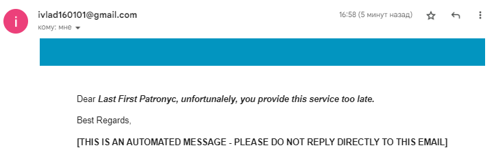

# Government Service

## Использованные технологии

1. PostgresSQL
2. Spring Framework 6.0.11
3. SpringBoot 3.1.5
4. Spring Data JPA
5. Spring Security
6. JUnit5
7. Mockito
8. MapStruct 1.5.5.Final
9. Thymeleaf 3.1.2.RELEASE

## Установка

### Установка на кластер Kubertenes

Для установки на кластер смотрите документ  ["Инструкция развертывания в Kubernetes"](../k8s/README.md).

### Установка с помощью docker-compose

Перед началом убедитесь, что у вас установлен Docker и Docker Compose.

Находясь в корневой директории выполните следующие шаги:

1. Откройте .env и установите значения для параметров `SMTP_USERNAME` и `SMTP_PASSWORD`.
    > При необходимости переопределите параметры базы данных.

2. Выполните команду `docker-compose up -d` для запуска Docker Compose. Docker Compose запустит PostgreSQL, приложение и Nginx в фоновом режиме.
Приложение будет доступно по адресу `http://localhost:8080`.

3. Для остановки и удаления контейнеров выполните команду `docker-compose down`.

## Проверка работоспособности

### Проверка работоспособности приложения Government Service

Для проверки работоспособности сделайте запрос на любой Endpoint, например на `/actuator/health`. Пример запроса: `curl -H 'Content-Type: application/json' -XGET localhost/actuator/health -i`.
Пример вывода:
```shell
HTTP/1.1 200 
Server: nginx/1.25.3
Date: Thu, 16 Nov 2023 09:55:39 GMT
Content-Type: application/vnd.spring-boot.actuator.v3+json
Transfer-Encoding: chunked
Connection: keep-alive
X-Content-Type-Options: nosniff
X-XSS-Protection: 0
Cache-Control: no-cache, no-store, max-age=0, must-revalidate
Pragma: no-cache
Expires: 0
X-Frame-Options: DENY

{"status":"UP","groups":["liveness","readiness"]}
```

### Проверка работоспособности работы SMTP сервера в приложении

Для проверки работоспособности сделайте POST-запрос на Endpoint `/test/email`, передав в теле целевой адрес почты. Пример запроса: `curl -H 'Content-Type: application/json' -d 'dlawotakk@gmail.com' -XPOST govservice.com/test/email -i`.
Пример вывода:
```shell
HTTP/1.1 200 
Date: Thu, 16 Nov 2023 09:58:26 GMT
Content-Type: application/json
Content-Length: 33
Connection: keep-alive
X-Content-Type-Options: nosniff
X-XSS-Protection: 0
Cache-Control: no-cache, no-store, max-age=0, must-revalidate
Pragma: no-cache
Expires: 0
X-Frame-Options: DENY

Email send to dlawotakk@gmail.com
```

На почту должно прийти письмо, указанное ниже.



## Использование приложения

Для просмотра доступных endpoints и подробной документации API, обратитесь к файлу [api-docs.yaml](resources/api-docs.yaml). Данный файл является спецификацией [OpenAPI](https://spec.openapis.org/oas/latest.html).


